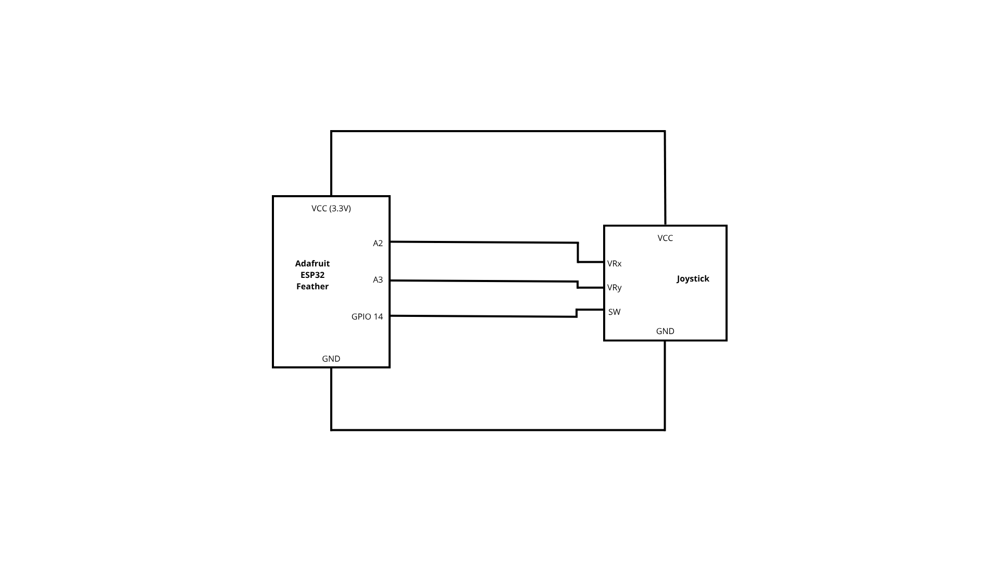
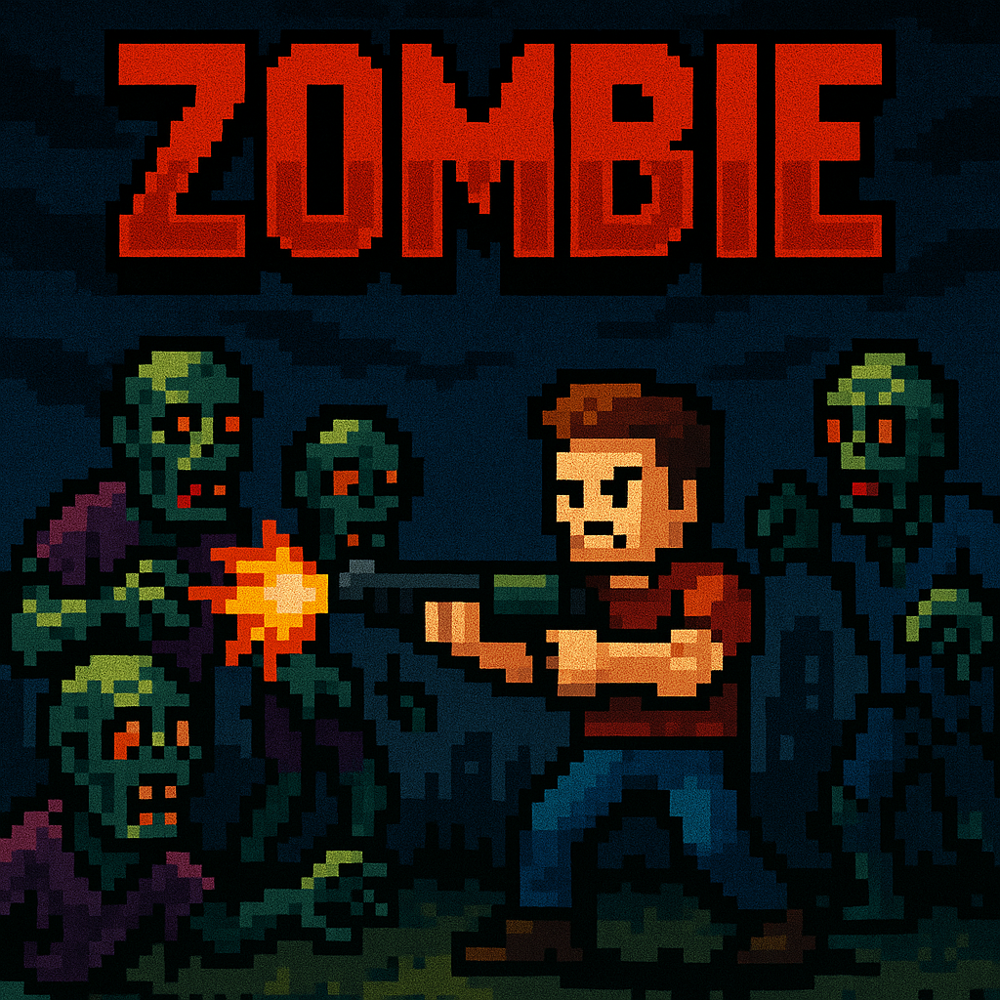
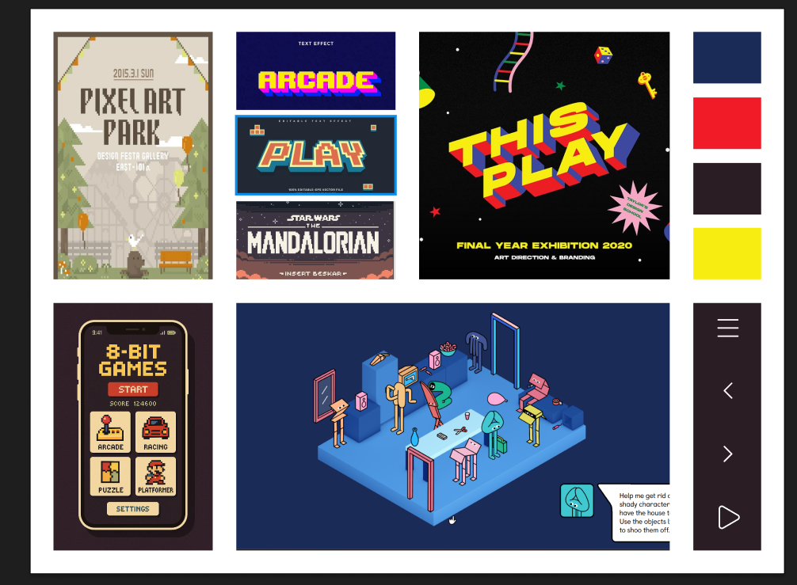
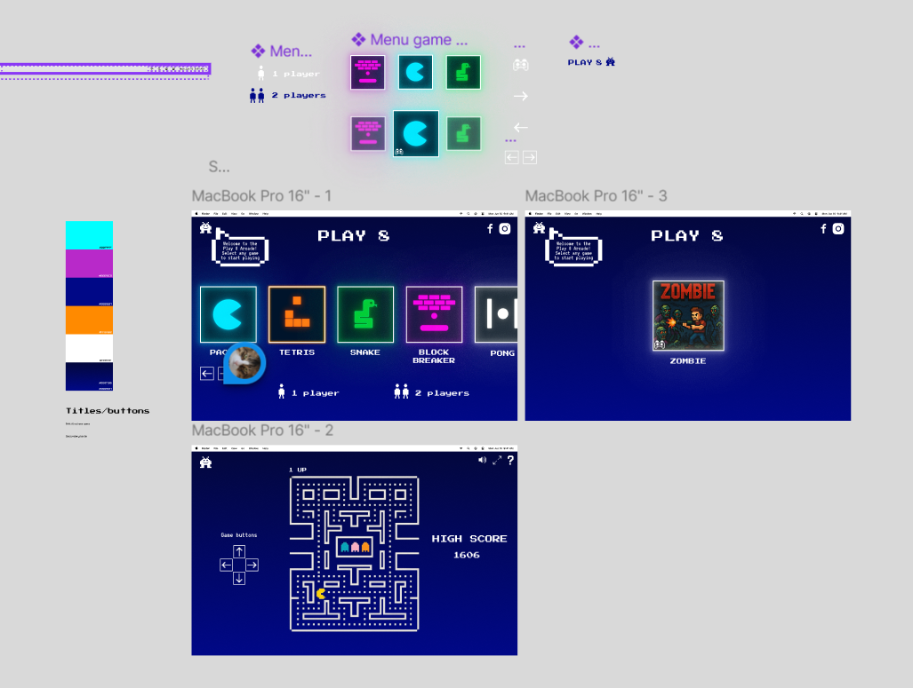

# DWW & CWIOT final project

Play 8 is a project that connects a physical joystick to a web-based game using an ESP32 microcontroller and the Adafruit IO platform.
The joystick sends its movement values to the cloud, and this data is used in a webpage built with p5.js to move a character within the canvas.
This allows the user to control the game from a real device, combining hardware and software in an interactive experience.

### CWIOT

#### Schematic view 

#### Photographs
Youtube video of the prototype lerping between colors

### DWW

#### Moodboard

#### User flow 
[See the user flow in figma↗](https://www.figma.com/design/dM1YMjAZRYZsTOU9vZPyeU/Play-8-App?node-id=0-1&p=f&t=8awFqtHE7ahe7xf6-0)

